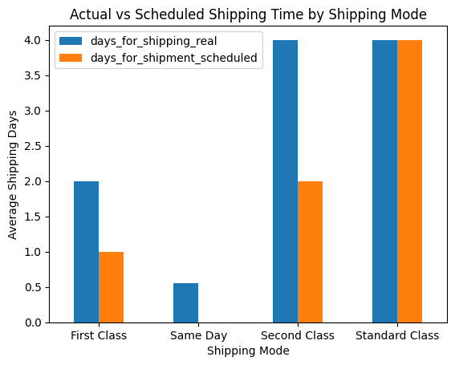
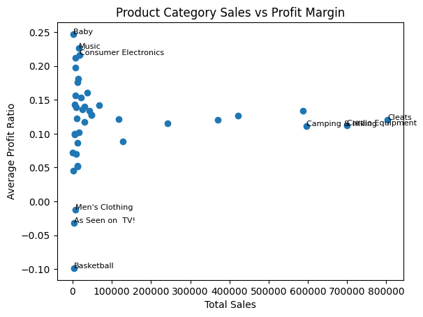
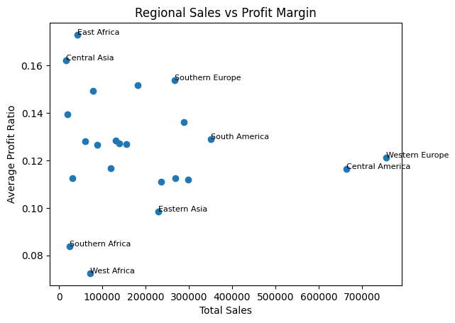
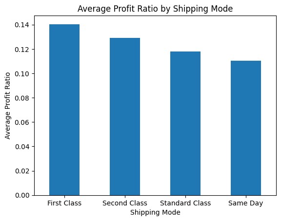

# Retail Operations Profitability Analysis

---

## Interactive Tableau Dashboard

View the live dashboard here:

[Executive Operations Dashboard](https://public.tableau.com/app/profile/mariah.alexander/viz/Executive_Operations_Dashboard/ExecutiveOperationsDashboard?publish=yes)

---

# Project Overview

This business intelligence and exploratory data analysis project investigates declining profitability within a retail company despite continued sales growth.

The analysis focuses on:
- operational performance
- shipping efficiency
- regional profitability
- product category performance
- customer segment behavior
- fraud-related activity

The objective of this project is to identify operational inefficiencies, evaluate business hypotheses, and generate data-driven recommendations to improve profitability and operational performance.

---

# Business Questions

- Why is profitability declining despite increasing sales volume?
- Are shipping delays negatively impacting profitability?
- Which regions generate the highest sales but weakest margins?
- Which product categories are most and least profitable?
- Does shipping mode influence late delivery risk?
- Are discounts reducing overall profitability?
- Are certain customer segments more profitable than others?
- Are fraud-related orders impacting operational performance?

---

# Hypotheses

- Higher discount rates may reduce profitability.
- Standard shipping may increase late delivery risk.
- Some regions may generate high sales but weak profit margins.
- Certain product categories may produce high sales volume but low profitability.
- Late deliveries may contribute to operational losses through returns, refunds, or customer dissatisfaction.
- Faster shipping methods may improve profitability enough to justify increased shipping costs.
- Fraud-related orders may negatively impact operational performance and profitability.

---

# Tools & Technologies

- Python
- Pandas
- NumPy
- Matplotlib
- Jupyter Notebook
- Tableau (dashboard development)

---

# Project Workflow

1. Data cleaning and preprocessing  
2. KPI identification and feature engineering  
3. Exploratory data analysis (EDA)  
4. Operational and profitability analysis  
5. Business recommendations and strategic insights  
6. Dashboard development (in progress)  

---

# Key Areas of Analysis

## Operational Performance
- Shipping mode analysis
- Late delivery analysis
- Delivery status investigation

## Financial Performance
- Profitability trends
- Profit ratio analysis
- Discount impact analysis

## Regional Analysis
- Regional sales performance
- Regional margin efficiency
- High-sales vs low-margin regions

## Product Performance
- Product category profitability
- High-margin vs low-margin categories

## Customer Analysis
- Customer segment profitability
- Consumer vs Corporate vs Home Office performance

## Fraud Investigation
- Fraud vs non-fraud financial comparison
- Fraud-related operational patterns

---

# Key Visualizations

## Shipping Mode vs Actual Late Delivery Rate

This visualization compares actual late delivery rates across shipping methods and highlights the relationship between delivery expectations and operational performance.

---

## Product Category Profitability

This analysis identifies product categories generating high sales volume versus those producing stronger profit margins and profitability efficiency.

---

## Regional Profitability Analysis

Regional analysis highlights areas with strong sales performance but weaker margins, helping identify regions requiring operational review.

---

## Shipping Mode vs Profitability

This visualization compares shipping methods by average profit per order and profit ratio to evaluate operational efficiency and financial performance.

---

# Key Findings

- Higher discount levels were associated with lower profitability.
- First Class and Second Class shipping methods experienced the highest late delivery rates.
- Some high-sales regions demonstrated relatively weak profit margins.
- Certain product categories generated strong sales volume but poor profitability efficiency.
- Same Day shipping produced the weakest profitability metrics.
- Fraud-related orders did not demonstrate weaker financial performance within the available dataset.

---

# Business Recommendations

- Reevaluate aggressive discounting strategies.
- Improve delivery promise accuracy for expedited shipping methods.
- Focus growth efforts on high-margin product categories.
- Investigate low-margin regions for operational inefficiencies.
- Reassess Same Day shipping profitability.
- Expand fraud analysis using operational loss metrics.

---

# Repository Contents

| File | Description |
|---|---|
| `retail_operations_profitability_analysis.ipynb` | Full exploratory data analysis notebook |
| `cleaned_retail_data.csv` | Cleaned dataset used for analysis |
| `README.md` | Project overview and documentation |

---

# Future Improvements

- Build an interactive Tableau dashboard
- Perform statistical hypothesis testing
- Develop predictive models for profitability and late deliveries
- Expand time-series analysis
- Create executive KPI dashboards

---

# Author

Mariah Alexander  
MS Mathematics | Business Intelligence & Data Analytics Enthusiast
